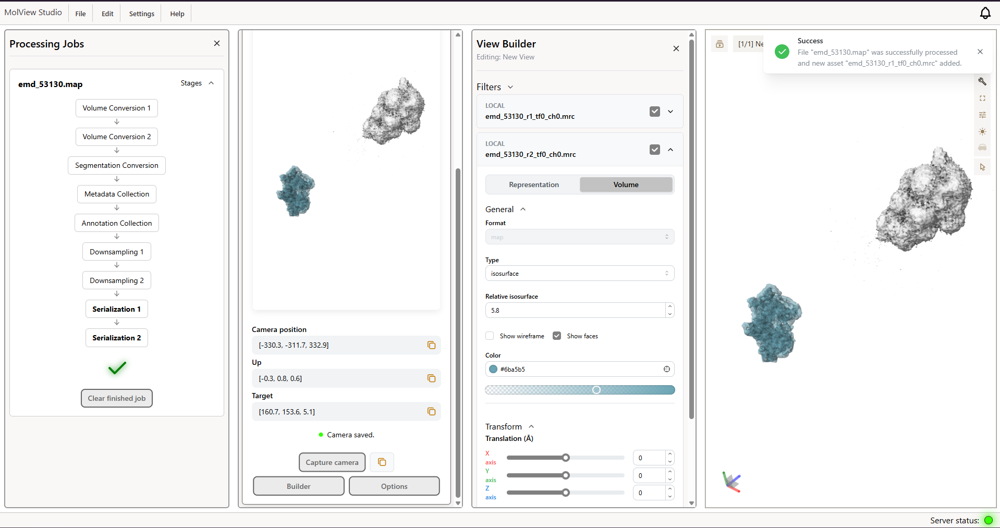

<div align="center">

# MolView Studio

**Desktop-native structural biology workspace — volumes, segmentations, and MolViewSpec views, all in one app.**

[](./LICENSE)
[](https://github.com/kerrambit/MolViewStudio/actions/workflows/build-release.yml)
[](https://github.com/kerrambit/MolViewStudio/releases/latest)
[](https://github.com/kerrambit/MolViewStudio/issues)

[Features](#features) · [Download](#download) · [Getting Started](#getting-started) · [Development](#development) · [Contributing](#contributing)

</div>

---

<p align="center">
  
</p>

## About

MolView Studio is a cross-platform desktop application for working with structural biology data. It lets you:

-   **Load structures and density volumes** and explore them interactively with the modern [Mol\* (Molstar)](https://github.com/molstar/molstar) viewer.
-   **Process volumes and run segmentations** locally, powered by the [volseg-tools](https://github.com/DanielKriz/volseg-tools) Python library through a bundled FastAPI server.
-   **Build and inspect custom views** using the [MolViewSpec](https://molviewspec.org/) (MVS) format — annotate, compose, and share reproducible visualizations.

The app ships as a self-contained Electron desktop application with a local Python processing backend — no browser setup or cloud services required.

## Download

MolView Studio is available for **Windows** and **Linux** (macOS builds coming in a future release). Grab the latest installer from the [Releases page](https://github.com/kerrambit/MolViewStudio/releases), or update in place using the app's built-in auto-update feature.

## Getting Started

### Prerequisites

-   [Node.js](https://nodejs.org/) (LTS)
-   [Python 3.12](https://www.python.org/downloads/)
-   Git

### Install & Run

**1. Build the local processing server**

The server (FastAPI + `volseg-tools`) is packaged into a standalone binary with PyInstaller:

```bash
python -m pip install --upgrade pip
pip install pyinstaller
pip install -r src/server/requirements.txt

npm run build:server
```

> Tip: if you use [uv](https://docs.astral.sh/uv/), you can replace the PyInstaller steps with `npm run build:server:uv`.

**2. Install TS dependencies**

```bash
npm install
```

**3. Package the app**

Windows:

```bash
npm run dist:win
```

Linux:

```bash
npm run dist:linux
```

macOS:

```bash
npm run dist:mac
```

Installers are written to the `dist_electron/` output directory.

## Development

After building the server (see the [Build server as developer](https://github.com/kerrambit/MolViewStudio/wiki/Build-server-as-developer) wiki page), run the app in dev mode with hot reloading powered by Vite:

```bash
npm install
npm run dev
```

Useful scripts:

| Script                 | Description                                              |
| ---------------------- | -------------------------------------------------------- |
| `npm run dev`          | Run Electron + React UI with hot reloading               |
| `npm run build`        | Type-check and build the renderer bundle                 |
| `npm run lint`         | Run ESLint                                               |
| `npm run build:server` | Build the Python processing server binary                |
| `npm run server`       | Run the processing server directly (normally not needed) |

### Project Structure

The app is split into three main parts:

-   `src/ui` — React 19, Mantine, Molstar (viewer, workspace, settings, and feature modules)
-   `src/electron` — Electron main process (window management, IPC, file storage, auto-update)
-   `src/server` — Python FastAPI service for volume processing and segmentation

More details on the individual parts, scripts, and the server are available on the [project wiki](https://github.com/kerrambit/MolViewStudio/wiki).

## Contributing

There are many ways to participate in this project:

-   [Submit bugs and feature requests](https://github.com/kerrambit/MolViewStudio/issues)
-   Improve documentation on the [wiki](https://github.com/kerrambit/MolViewStudio/wiki)

## License

Licensed under the [MIT](LICENSE) license.

Copyright (c) 2025 – present, MolView Studio contributors.
